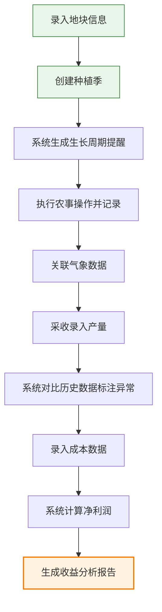

# 农业种植记录与农场管理工具 PRD

## 1. 产品概述
面向农业生产经营者的数字化种植管理平台，实现地块、种植季、农事操作、成本收益的全流程管理。通过数据采集与分析，帮助农户提升种植效率、降低生产成本、优化种植决策。

- **解决问题**：传统农业管理依赖经验记录，缺乏系统化的数据追踪和分析能力，难以量化操作效果和优化生产决策
- **目标用户**：家庭农场主、种植大户、农业合作社管理者
- **产品价值**：种植过程数字化、农事操作可追溯、成本收益精准核算、生产决策数据驱动

## 2. 核心功能

### 2.1 用户角色
| 角色 | 注册方式 | 核心权限 |
|------|----------|----------|
| 农场主 | 本地注册 | 全部功能权限，数据管理与分析 |

### 2.2 功能模块
1. **总览仪表盘**：关键指标概览、待办提醒、近期操作
2. **地块管理**：地块信息录入、列表展示、详情查看
3. **种植季管理**：创建种植季、播种信息管理、作物品种管理
4. **农事操作**：施肥/打药/灌溉记录、操作人管理、用量追踪
5. **生长周期提醒**：关键节点智能提醒、操作建议
6. **收成管理**：产量录入、历史对比、异常标注
7. **成本管理**：成本分类录入、明细记录
8. **收益分析**：利润计算、年度对比、品种收益报告
9. **气象信息**：温度降雨展示、与操作日志关联分析

### 2.3 页面详情
| 页面名称 | 模块名称 | 功能描述 |
|----------|----------|----------|
| 总览仪表盘 | 指标卡片 | 显示总地块数、在种作物、本月产量、本年收益等核心KPI |
| 总览仪表盘 | 待办提醒 | 展示待进行的农事操作、生长周期关键节点提醒 |
| 总览仪表盘 | 近期操作 | 时间线展示最近的农事操作记录 |
| 地块管理 | 地块列表 | 卡片式展示所有地块，包含面积、土质、位置、当前作物 |
| 地块管理 | 地块详情 | 展示地块完整信息、历史种植季、关联操作记录 |
| 地块管理 | 新增/编辑 | 表单录入地块名称、面积(亩)、土质类型、位置坐标/地址 |
| 种植季管理 | 种植季列表 | 按地块和年份展示所有种植季，含作物品种、播种日期、生长状态 |
| 种植季管理 | 创建种植季 | 选择地块、录入作物品种、播种日期、预计产量 |
| 种植季管理 | 生长周期 | 可视化展示生长阶段进度，关键节点标注 |
| 农事操作 | 操作列表 | 按时间展示所有操作，支持按地块、类型、时间筛选 |
| 农事操作 | 新增操作 | 选择种植季、操作类型(施肥/打药/灌溉)、日期、用量、操作人、备注 |
| 农事操作 | 操作详情 | 展示操作完整信息，关联气象数据 |
| 收成管理 | 收成录入 | 录入实际产量、采收日期、品质等级 |
| 收成管理 | 历史对比 | 图表展示同一地块历年产量对比，标注异常值 |
| 收成管理 | 异常分析 | 自动识别产量异常地块，展示相关操作和气象数据供分析 |
| 成本管理 | 成本列表 | 分类展示种子、农药、化肥、人工等成本明细 |
| 成本管理 | 成本录入 | 录入成本类型、金额、日期、关联种植季、备注 |
| 收益分析 | 利润计算 | 自动计算每亩成本、收益、净利润 |
| 收益分析 | 年度报告 | 各品种年度种植收益对比，柱状图/饼图展示 |
| 收益分析 | 效益排行 | 按净利润排序展示各地块/品种效益排名 |
| 气象信息 | 天气概览 | 展示近期温度、降雨量、湿度等气象数据 |
| 气象信息 | 历史气象 | 按日期查询历史气象记录 |
| 气象信息 | 关联分析 | 展示气象数据与农事操作、产量的关联趋势 |

## 3. 核心流程

### 主要用户流程
1. 农户录入地块基础信息（面积、土质、位置）
2. 为地块创建种植季，录入播种日期、作物品种、预计产量
3. 系统根据作物生长周期自动生成关键节点提醒
4. 农户执行农事操作时录入施肥/打药/灌溉记录（日期、用量、操作人）
5. 系统同步展示当日气象信息，自动关联到操作记录
6. 采收时录入实际产量，系统自动与历史数据对比并标注异常
7. 录入各类成本后，系统自动计算每亩净利润
8. 查看年度收益分析报告，对比各品种经济效益

## 4. 用户界面设计

### 4.1 设计风格
- **主色调**：自然绿 (#2e7d32) - 代表农业、生机、健康
- **辅助色**：土壤棕 (#8d6e63)、阳光黄 (#fdd835)、天空蓝 (#4fc3f7)
- **中性色**：米白 (#fafafa)、深灰 (#424242)
- **按钮风格**：圆角矩形，微阴影，悬停有轻微放大和颜色加深效果
- **字体**：标题使用 Lora（优雅衬线，体现自然质感），正文使用 Noto Sans SC（清晰易读）
- **布局风格**：侧边导航 + 卡片式内容区，层次分明，留白充足
- **图标风格**：线性图标，配色与主色调呼应，农业主题元素（麦穗、水滴、土壤等）

### 4.2 页面设计概述
| 页面名称 | 模块名称 | UI元素 |
|----------|----------|--------|
| 总览仪表盘 | 指标卡片 | 渐变背景图标、大字号数字、趋势箭头、卡片悬浮动效 |
| 总览仪表盘 | 待办提醒 | 带优先级标签的列表项，点击可快速跳转操作 |
| 地块管理 | 地块卡片 | 背景纹理（土壤/作物图案）、标签式状态展示、进度条 |
| 种植季管理 | 生长周期 | 时间轴设计，节点状态用不同颜色区分 |
| 农事操作 | 操作记录 | 图标+时间线布局，操作类型用颜色编码区分 |
| 收益分析 | 图表区域 | 响应式图表，悬浮显示详细数据，支持切换视图 |
| 气象信息 | 天气面板 | 大字号温度展示、天气图标、降雨柱状图 |

### 4.3 响应式
- 采用桌面优先设计，最小支持 1280px 宽度
- 平板端适配：侧边栏可折叠，卡片自适应排列
- 移动端适配：底部Tab导航，单列布局，针对触控优化按钮尺寸

## 5. 非功能性需求

### 5.1 性能要求
- 页面首次加载时间 < 2s
- 图表渲染时间 < 500ms
- 数据查询响应 < 300ms

### 5.2 数据存储
- 本地持久化存储（IndexedDB）
- 支持数据导出为 Excel/CSV 格式
- 支持数据备份与恢复

### 5.3 易用性
- 新手引导流程
- 表单自动保存
- 操作撤销功能
- 清晰的错误提示
