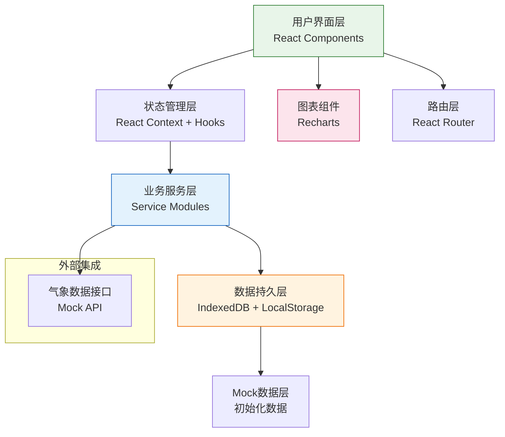
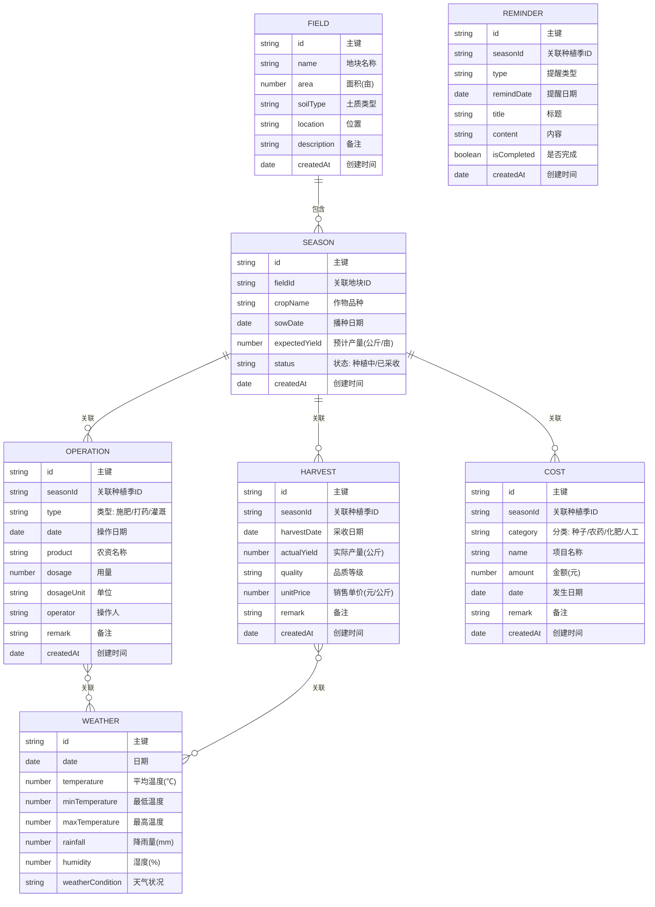

# 农业种植记录与农场管理工具 - 技术架构文档

## 1. 架构设计



## 2. 技术描述

### 2.1 前端技术栈
- **框架**: React 18 + TypeScript
- **构建工具**: Vite 5
- **样式方案**: TailwindCSS 3.4
- **路由管理**: React Router v6
- **图表库**: Recharts 2.10
- **图标库**: Lucide React
- **日期处理**: date-fns
- **数据存储**: IndexedDB (idb 库封装)
- **表单处理**: React Hook Form

### 2.2 初始化方式
- 使用 `npm create vite@latest` 初始化 React + TypeScript 项目
- 手动配置 TailwindCSS 及相关依赖
- 无需后端服务，全部数据本地持久化存储

### 2.3 数据存储方案
- **IndexedDB**: 存储结构化数据（地块、种植季、操作记录等）
- **LocalStorage**: 存储用户偏好设置、UI 状态
- **数据导入/导出**: 支持 JSON 格式备份与恢复

## 3. 路由定义

| 路由路径 | 页面名称 | 说明 |
|----------|----------|------|
| `/` | 总览仪表盘 | 核心指标、待办提醒、近期操作 |
| `/fields` | 地块管理 | 地块列表、新增/编辑地块 |
| `/fields/:id` | 地块详情 | 地块信息、历史种植季 |
| `/seasons` | 种植季管理 | 种植季列表、创建种植季 |
| `/seasons/:id` | 种植季详情 | 生长周期、操作记录、采收记录 |
| `/operations` | 农事操作 | 操作列表、新增操作记录 |
| `/harvest` | 收成管理 | 产量录入、历史对比、异常分析 |
| `/costs` | 成本管理 | 成本明细、新增成本 |
| `/analytics` | 收益分析 | 利润计算、年度报告、效益排行 |
| `/weather` | 气象信息 | 天气概览、历史气象、关联分析 |

## 4. 数据模型

### 4.1 实体关系图



### 4.2 作物生长周期配置

```typescript
interface GrowthStage {
  name: string;
  daysAfterSowing: number;
  durationDays: number;
  operations: string[];
}

interface CropConfig {
  name: string;
  totalGrowthDays: number;
  stages: GrowthStage[];
}

// 示例配置
const cropConfigs: Record<string, CropConfig> = {
  "小麦": {
    name: "小麦",
    totalGrowthDays: 230,
    stages: [
      { name: "播种期", daysAfterSowing: 0, durationDays: 10, operations: ["整地", "播种"] },
      { name: "出苗期", daysAfterSowing: 10, durationDays: 20, operations: ["查苗补种"] },
      { name: "分蘖期", daysAfterSowing: 30, durationDays: 50, operations: ["冬灌", "追肥"] },
      { name: "返青期", daysAfterSowing: 80, durationDays: 30, operations: ["返青肥", "除草"] },
      { name: "拔节期", daysAfterSowing: 110, durationDays: 25, operations: ["追肥", "灌溉", "防虫"] },
      { name: "抽穗期", daysAfterSowing: 135, durationDays: 30, operations: ["一喷三防", "灌溉"] },
      { name: "灌浆期", daysAfterSowing: 165, durationDays: 40, operations: ["叶面肥", "防虫"] },
      { name: "成熟期", daysAfterSowing: 205, durationDays: 25, operations: ["收获"] },
    ],
  },
  "玉米": {
    name: "玉米",
    totalGrowthDays: 120,
    stages: [
      { name: "播种期", daysAfterSowing: 0, durationDays: 7, operations: ["整地", "播种"] },
      { name: "苗期", daysAfterSowing: 7, durationDays: 25, operations: ["间苗定苗", "除草"] },
      { name: "拔节期", daysAfterSowing: 32, durationDays: 20, operations: ["追肥", "中耕", "灌溉"] },
      { name: "大喇叭口期", daysAfterSowing: 52, durationDays: 15, operations: ["追肥", "防虫"] },
      { name: "抽雄吐丝期", daysAfterSowing: 67, durationDays: 15, operations: ["灌溉", "人工授粉"] },
      { name: "灌浆期", daysAfterSowing: 82, durationDays: 30, operations: ["叶面肥", "防虫"] },
      { name: "成熟期", daysAfterSowing: 112, durationDays: 8, operations: ["收获"] },
    ],
  },
  "水稻": {
    name: "水稻",
    totalGrowthDays: 150,
    stages: [
      { name: "育秧期", daysAfterSowing: 0, durationDays: 30, operations: ["播种育秧", "苗床管理"] },
      { name: "移栽期", daysAfterSowing: 30, durationDays: 10, operations: ["整地", "移栽"] },
      { name: "分蘖期", daysAfterSowing: 40, durationDays: 30, operations: ["追肥", "除草", "灌溉"] },
      { name: "拔节孕穗期", daysAfterSowing: 70, durationDays: 30, operations: ["追肥", "晒田", "防虫"] },
      { name: "抽穗开花期", daysAfterSowing: 100, durationDays: 15, operations: ["灌溉", "防虫"] },
      { name: "灌浆成熟期", daysAfterSowing: 115, durationDays: 35, operations: ["干湿灌溉", "收获"] },
    ],
  },
};
```

## 5. 项目目录结构

```
src/
├── components/          # 公共组件
│   ├── Layout/         # 布局组件
│   ├── Cards/          # 卡片组件
│   ├── Charts/         # 图表组件
│   ├── Forms/          # 表单组件
│   └── Common/         # 通用组件(按钮、模态框等)
├── pages/              # 页面组件
│   ├── Dashboard/
│   ├── Fields/
│   ├── Seasons/
│   ├── Operations/
│   ├── Harvest/
│   ├── Costs/
│   ├── Analytics/
│   └── Weather/
├── services/           # 业务服务层
│   ├── fieldService.ts
│   ├── seasonService.ts
│   ├── operationService.ts
│   ├── harvestService.ts
│   ├── costService.ts
│   ├── weatherService.ts
│   └── reminderService.ts
├── store/              # 状态管理
│   ├── AppContext.tsx
│   └── hooks.ts
├── db/                 # 数据层
│   ├── index.ts        # IndexedDB 初始化
│   └── models.ts       # 数据模型定义
├── data/               # Mock 数据
│   ├── mockData.ts
│   └── cropConfigs.ts
├── types/              # TypeScript 类型定义
│   └── index.ts
├── utils/              # 工具函数
│   ├── dateUtils.ts
│   ├── calculationUtils.ts
│   └── exportUtils.ts
├── App.tsx
├── main.tsx
└── index.css
```

## 6. 核心业务逻辑

### 6.1 生长周期提醒生成算法
```
输入: 播种日期, 作物品种
输出: 提醒事项列表

流程:
1. 根据作物品种获取生长周期配置
2. 遍历每个生长阶段:
   - 计算阶段开始日期 = 播种日期 + daysAfterSowing
   - 生成该阶段建议的操作提醒
   - 设置提醒日期为阶段开始前3天
3. 存储所有未完成的提醒
4. 进入待办列表
```

### 6.2 产量异常检测算法
```
输入: 地块ID, 当前产量, 历史产量数据
输出: 异常标记及原因分析

流程:
1. 获取该地块前3年同作物的平均产量
2. 计算标准差 σ
3. 偏差率 = (当前产量 - 历史平均) / 历史平均
4. 判断规则:
   - 偏差率 > 20% 或 < -20%: 显著异常 (红色标记)
   - 偏差率 > 10% 或 < -10%: 轻微异常 (黄色标记)
   - 其他: 正常 (绿色标记)
5. 关联分析同期的气象数据和操作记录，提供可能原因
```

### 6.3 利润计算逻辑
```
每亩成本 = (种子成本 + 农药成本 + 化肥成本 + 人工成本 + 其他成本) / 地块面积
每亩收入 = (实际产量 × 销售单价) / 地块面积
每亩净利润 = 每亩收入 - 每亩成本
总收益 = 每亩净利润 × 地块面积
投资回报率 = (总收益 / 总成本) × 100%
```

## 7. 气象数据模拟

由于不接入真实气象API，采用模拟数据：

- 根据日期生成符合季节特征的温度、降雨数据
- 随机但符合自然规律的波动
- 支持按日期范围查询历史气象
- 农事操作时自动关联当日气象数据
